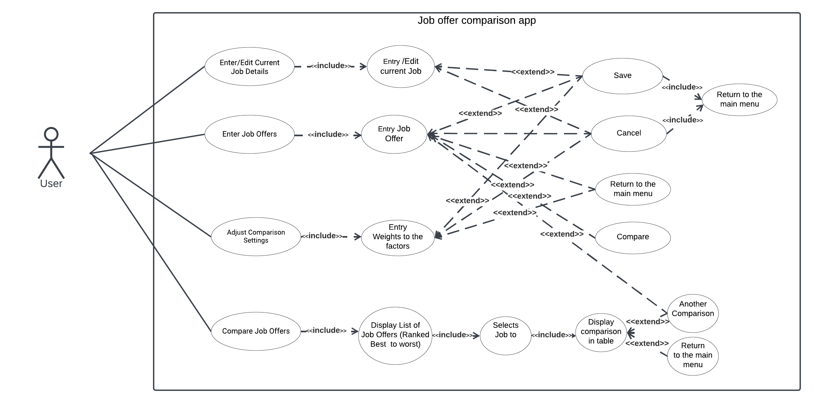

 # Use Case Model

## 1 Use Case Diagram
  

## 2 Use Case Descriptions

1 Use Case: Enter/Edit Current Job Details

Requirements: Users are able to “enter (if it is the first time) or edit all the details of their current job” and also “save the job details or cancel and exit without saving, returning in both cases to the main menu.”

Pre-conditions: User is on the main menu.
Post-conditions: The current job details are saved and returned to the main menu. If the user chooses “cancel” it will return to the main menu.
Scenarios:
* The user selects the "Enter/Edit Current Job Details" from the main menu. 
* The user will be shown a UI to enter or edit the details of their current job. 
* The user enters or edits the job details. 
* After that the user can either save the job details or cancel. 
* In both cases the user will be returned to the main menu. 

2 Use Case: Enter Job Offers

Requirements: Users are able to “enter all the details of the offer”, “save the job offer details or cancel.”, “enter another offer”,  “return to the main menu” or “ compare the offer (if they saved it) with the current job details (if present).”

Pre-conditions: User is on the main menu.
Post-conditions: The job offer details are saved (if the user chooses to save) . If the user chooses “cancel” it will return to the main menu.Rr in compared jobs offers UI if user chooses “compare”.
Scenarios:
* The user selects the "Enter Job Offers" option from the main menu.
* The user will be shown a UI to enter  the details of the job offer. 
* The user enters  the job offer details. 
* If the user selects “save” it will save the details.
* If the user selects “Enter another offer” app will be shown a UI to enter another job offer. 
* There will be other options like -, Return to the main menu, Compare the offer if they saved it with the current job details (if present)

3 Use Case: Adjust Comparison Settings

Requirements: Users are able to “assign integer weights” to the attributes. 
Pre-conditions: User is on the main menu.
Post-conditions: The weights in comparison settings are saved.

Scenarios:
* The user selects the "Adjust Comparison Settings" option from the main menu.
* The user will be shown a UI to enter the weights of the Comparison Settings factors.
* The user enters the weights of the Comparison Settings factors.
* If the user selects “save” it will save the details.
* The app returns to the main menu after saving.

4 Use Case: Compare Job Offers

Requirements: Users are able to “show a list of job offers ranked from best to worst”, “Select two jobs to compare and trigger the comparison” , “shown a table comparing the two jobs,” and “perform another comparison or go back to the main menu.”

Pre-conditions: User is on the main menu.
Post-conditions: The user could do another comparison or return to the main menu.

Scenarios:
* The user selects the "Compare Job Offers" option from the main menu.
* The user will show an UI with a list of job offers, ranked from best to worst
* The user selects 2 job offers and triggers the comparison.
* The user will show an UI with a table comparing the two jobs.
* The user could either choose “another comparison” or “return to the main menu.”

